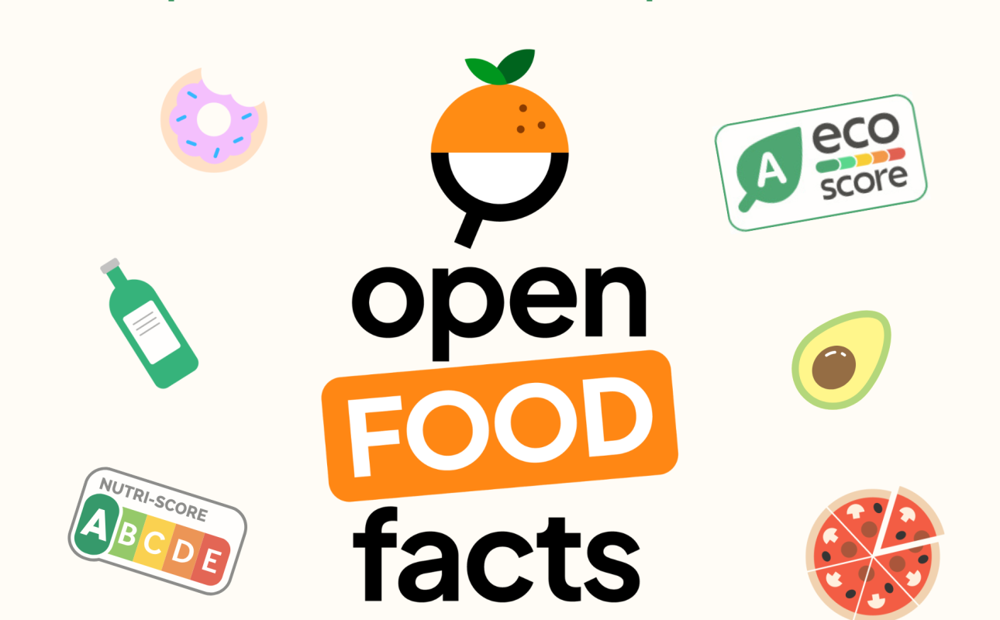

<u>### Contexte:</u>
Dans le cadre de votre travail de Développeur IA pour une ONG dont la mission est d'améliorer la santé mondiale, vous êtes confronté à la problématique de la mauvaise alimentation et de ses conséquences sur la santé publique. L'accès à une information claire et concise sur la composition nutritionnelle des aliments est crucial pour permettre aux individus de faire des choix éclairés. Ce projet vise à exploiter le jeu de données Open Food Facts pour développer un outil d'analyse et de visualisation des données nutritionnelles, inspiré de l'application Yuka.

### Objectifs:
Analyser les données d'Open Food Facts: Réaliser une analyse descriptive et exploratoire du jeu de données pour identifier les tendances, les corrélations et les informations clés relatives à la composition des aliments.
Développer un programme d'analyse: Créer un programme en Python qui répond à des questions spécifiques sur les aliments et leurs caractéristiques nutritionnelles, afin d'extraire des informations pertinentes pour la santé publique.
Visualiser les données: Présenter les résultats de l'analyse et du programme de manière claire et accessible, en utilisant des visualisations pertinentes et informatives.

### Les données
Lien de téléchargement dans le dépôt Github en .zip

[Source Openfoodfacts](https://fr.openfoodfacts.org/)

### Questions clés:
En vous basant sur les colonnes du dataset Open Food Facts, répondez à ces questions et formulez des hypothèses pour orienter votre analyse :

### Composition et caractéristiques des aliments:
1/Qu'est-ce qui caractérise un aliment sain ? (Nutri-Score, ingrédients, additifs, etc.)

2/Combien y a-t-il d'aliments dans chaque catégorie ? (produits laitiers, fruits et légumes, viandes, etc.)

3/Quels sont les aliments les plus sains de chaque catégorie ?

4/Y a-t-il des valeurs redondantes dans le jeu de données ? (informations dupliquées ou corrélées)

5/Quels aliments contiennent le plus/le moins d'allergènes, d'additifs ?

6/Existe-t-il une corrélation entre la quantité de sucre et le Nutri-Score ?

7/Quelle est la proportion d'aliments contenant de l'huile de palme ?

8/Quels sont les ingrédients les plus fréquents dans les aliments transformés ?

9/Comment la teneur en sel varie-t-elle en fonction des catégories d'aliments ?

10/Existe-t-il une corrélation entre la présence d'additifs et la valeur nutritionnelle des aliments ?

### Nutri-Score et informations nutritionnelles:
11/Comment se calcule le Nutri-Score (FR et UK) ? Qu'est-ce qui les différencie ?

12/Y a-t-il des différences significatives entre le Nutri-Score FR et UK pour les mêmes aliments ?

13/Quels sont les nutriments les plus présents/les plus absents dans chaque catégorie d'aliments ?

14/Existe-t-il une corrélation entre le prix d'un produit et sa qualité nutritionnelle (Nutri-Score) ?

15/Comment la composition nutritionnelle des aliments varie-t-elle d'un pays à l'autre ?

### Contribution et origine des données: [Bloc traité dans le .pdf]

16/Quels sont les pays les plus contributeurs à Open Food Facts ?

17/Existe-t-il des biais géographiques dans les données ?

18/Quels sont les labels de qualité les plus fréquents ? Sont-ils associés à des produits plus sains ?

19/Comment la qualité des données varie-t-elle en fonction des contributeurs ?

20/Peut-on identifier des tendances dans l'évolution des données au fil du temps ?

### Applications possibles:
Carte des pays contributeurs avec Folium: Visualiser la répartition géographique des contributions à Open Food Facts.

Programme de substitution d'aliments: Développer un programme qui suggère des alternatives plus saines à un aliment donné.

Intégration avec une IA: Utiliser l'API de ChatGPT ou Gemini pour obtenir des informations complémentaires sur les aliments (origine, impact environnemental, recettes...).

Web scraping: Collecter davantage de données sur Open Food Facts ou d'autres sources pour enrichir l'analyse.

Application web interactive: Créer une interface web permettant aux utilisateurs de rechercher des aliments et de visualiser leurs informations nutritionnelles.

Analyse comparative des marques: Comparer la qualité nutritionnelle des produits de différentes marques.

### Livrables:
Rapport d'analyse descriptive et exploratoire

Code source du programme

Visualisations des données

Présentation des résultats

### Technologies:
Python (Pandas, NumPy, matplotlib/seaborn, Folium)

API ChatGPT ou Gemini (optionnel)

Bibliothèques de web scraping (Beautiful Soup, Scrapy) (optionnel)

